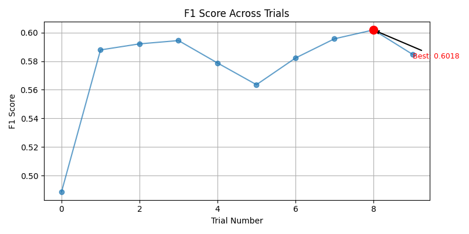
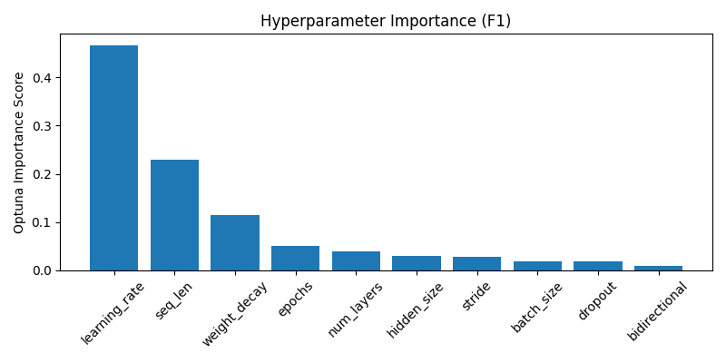
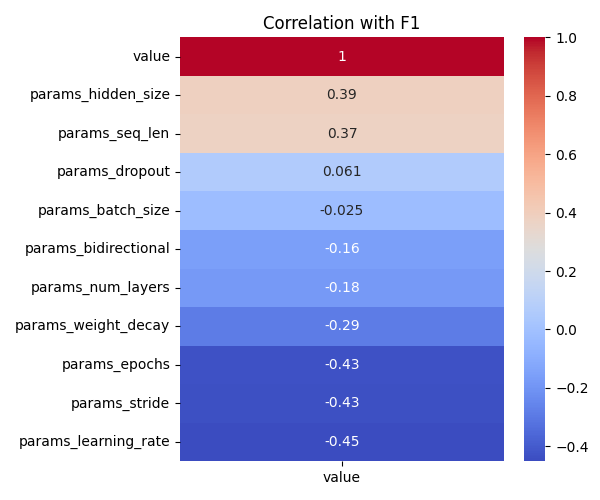

# Optuna LSTM Tuning Summary
- Date: 2025-06-24
- Subject: 7012
- Trials: 10
- Objective: Maximize F1 Score

---

## Best Trial
- **F1 Score**: 0.6018
- **Threshold**: 0.58
- **Accuracy**: 0.557
- **Params**
  - `hidden_size`: 128
  - `num_layers`: 3
  - `dropout`: 0.32605054158312186
  - `bidirectional`: True
  - `learning_rate`: 0.00020340178788509072
  - `stride`: 1
  - `seq_len`: 64
  - `epochs`: 9
  - `batch_size`: 64
  - `weight_decay`: 0.0022291764931384015

---

## Top 5 Trials
| Trial | F1 Score | Threshold | Accuracy |
|-------|----------|-----------|----------|
| 8 | 0.6018 | 0.58 | 0.5570 |
| 7 | 0.5956 | 0.6 | 0.5515 |
| 3 | 0.5944 | 0.57 | 0.5489 |
| 2 | 0.5921 | 0.5 | 0.5488 |
| 1 | 0.5879 | 0.5 | 0.5473 |

---

## Visualizations
### F1 Line Plot

### Hyperparameter Importance

### Correlation Heatmap

---

## Notes