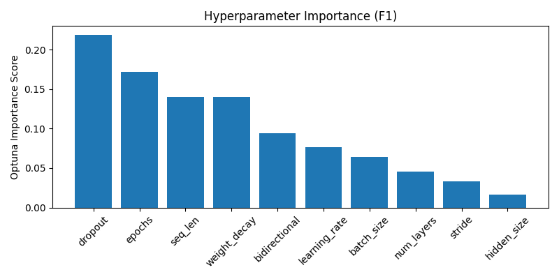

# Optuna LSTM Tuning Summary
- Date: 2025-05-21
- Subject: 7242
- Trials: 5
- Objective: Maximize F1 Score

---

## Best Trial
- **F1 Score**: 0.8088
- **Threshold**: 0.62
- **Accuracy**: 0.8076
- **Params**
  - `hidden_size`: 128
  - `num_layers`: 2
  - `dropout`: 0.46113270413265095
  - `bidirectional`: False
  - `learning_rate`: 0.00011982944130266843
  - `stride`: 1
  - `seq_len`: 64
  - `epochs`: 9
  - `batch_size`: 64
  - `weight_decay`: 1.3467657668402778e-05

---

## Top 5 Trials
| Trial | F1 Score | Threshold | Accuracy |
|-------|----------|-----------|----------|
| 3 | 0.8088 | 0.62 | 0.8076 |
| 1 | 0.7873 | 0.64 | 0.7949 |
| 4 | 0.7354 | 0.61 | 0.7179 |
| 2 | 0.5679 | 0.67 | 0.5248 |
| 0 | 0.5405 | 0.38 | 0.4990 |

---

## Visualizations
### Hyperparameter Importance

### Correlation Heatmap

---

## Notes