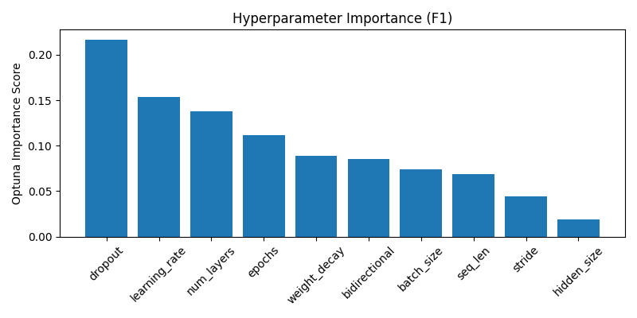
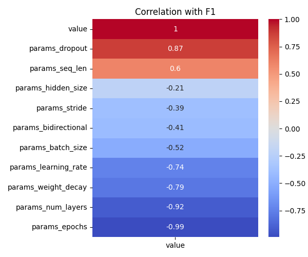

# Optuna LSTM Tuning Summary
- Date: 2025-05-22
- Subject: 7242
- Trials: 5
- Objective: Maximize F1 Score

---

## Best Trial
- **F1 Score**: 0.5242
- **Threshold**: 0.5
- **Accuracy**: 0.503
- **Params**
  - `hidden_size`: 64
  - `num_layers`: 2
  - `dropout`: 0.36965344602653816
  - `bidirectional`: True
  - `learning_rate`: 0.001720021822320989
  - `stride`: 2
  - `seq_len`: 128
  - `epochs`: 8
  - `batch_size`: 64
  - `weight_decay`: 0.003062273519768889

---

## Top 5 Trials
| Trial | F1 Score | Threshold | Accuracy |
|-------|----------|-----------|----------|
| 1 | 0.5242 | 0.5 | 0.5030 |
| 3 | 0.4783 | 0.5 | 0.4857 |
| 4 | 0.3823 | 0.5 | 0.3989 |
| 0 | 0.2577 | 0.5 | 0.3197 |
| 2 | 0.1891 | 0.5 | 0.2872 |

---

## Visualizations
### Hyperparameter Importance

### Correlation Heatmap

---

## Notes