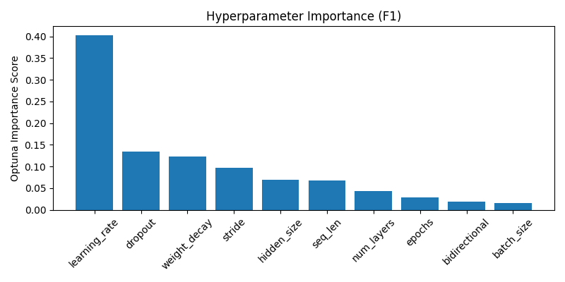
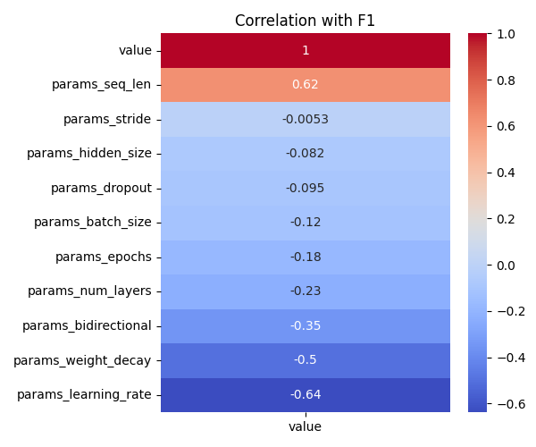

# Optuna LSTM Tuning Summary
- Date: 2025-05-23
- Subject: 7242
- Trials: 2
- Objective: Maximize F1 Score

---

## Best Trial
- **F1 Score**: 0.5725
- **Threshold**: 0.53
- **Accuracy**: 0.5255
- **Params**
  - `hidden_size`: 64
  - `num_layers`: 3
  - `dropout`: 0.2994028049210362
  - `bidirectional`: True
  - `learning_rate`: 0.003319414023327547
  - `stride`: 4
  - `seq_len`: 32
  - `epochs`: 13
  - `batch_size`: 64
  - `weight_decay`: 0.005666597524267947

---

## Top 5 Trials
| Trial | F1 Score | Threshold | Accuracy |
|-------|----------|-----------|----------|
| 0 | 0.5725 | 0.53 | 0.5255 |
| 1 | 0.5496 | 0.58 | 0.5126 |

---

## Visualizations
### Hyperparameter Importance

### Correlation Heatmap

---

## Notes