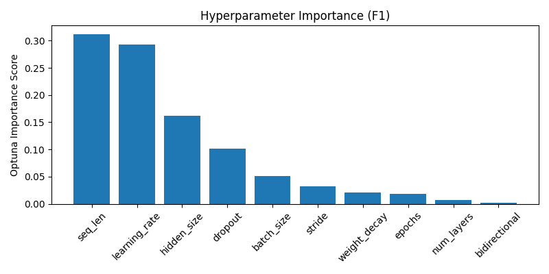
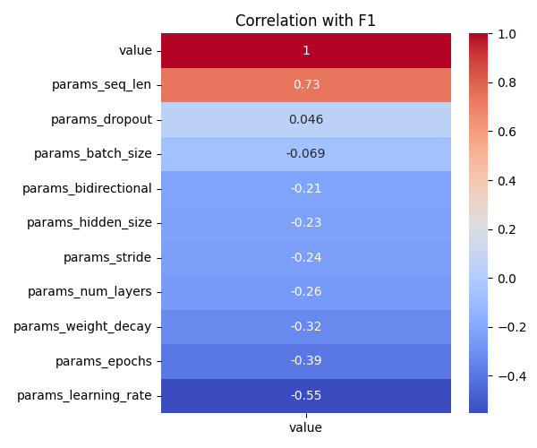

# Optuna LSTM Tuning Summary
- Date: 2025-05-25
- Subject: 7242
- Trials: 10
- Objective: Maximize F1 Score

---

## Best Trial
- **F1 Score**: 0.8023
- **Threshold**: 0.58
- **Accuracy**: 0.7981
- **Params**
  - `hidden_size`: 128
  - `num_layers`: 2
  - `dropout`: 0.46113270413265095
  - `bidirectional`: False
  - `learning_rate`: 0.00011982944130266843
  - `stride`: 1
  - `seq_len`: 64
  - `epochs`: 9
  - `batch_size`: 64
  - `weight_decay`: 1.3467657668402778e-05

---

## Top 5 Trials
| Trial | F1 Score | Threshold | Accuracy |
|-------|----------|-----------|----------|
| 3 | 0.8023 | 0.58 | 0.7981 |
| 1 | 0.7934 | 0.67 | 0.8013 |
| 9 | 0.7505 | 0.32 | 0.7266 |
| 4 | 0.7176 | 0.6 | 0.6963 |
| 2 | 0.6106 | 0.58 | 0.5663 |

---

## Visualizations
### Hyperparameter Importance

### Correlation Heatmap

---

## Notes