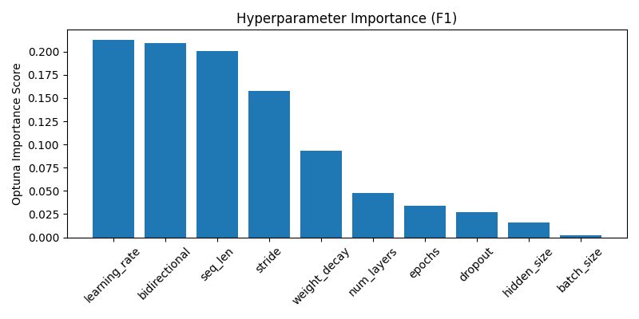
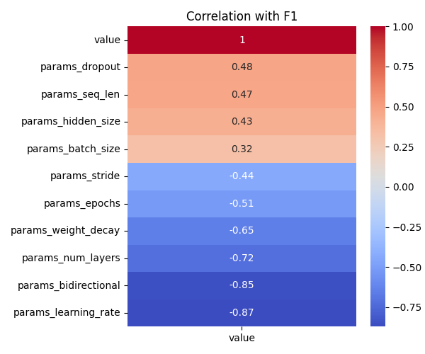

# Optuna LSTM Tuning Summary
- Date: 2025-05-26
- Subject: 7242
- Trials: 5
- Objective: Maximize F1 Score

---

## Best Trial
- **F1 Score**: 0.7781
- **Threshold**: 0.56
- **Accuracy**: 0.7673
- **Params**
  - `hidden_size`: 128
  - `num_layers`: 2
  - `dropout`: 0.46113270413265095
  - `bidirectional`: False
  - `learning_rate`: 0.00011982944130266843
  - `stride`: 1
  - `seq_len`: 64
  - `epochs`: 9
  - `batch_size`: 64
  - `weight_decay`: 1.3467657668402778e-05

---

## Top 5 Trials
| Trial | F1 Score | Threshold | Accuracy |
|-------|----------|-----------|----------|
| 3 | 0.7781 | 0.56 | 0.7673 |
| 4 | 0.7349 | 0.59 | 0.7174 |
| 2 | 0.5639 | 0.55 | 0.5215 |
| 1 | 0.5317 | 0.55 | 0.4964 |
| 0 | 0.3150 | 0.36 | 0.3333 |

---

## Visualizations
### Hyperparameter Importance

### Correlation Heatmap

---

## Notes