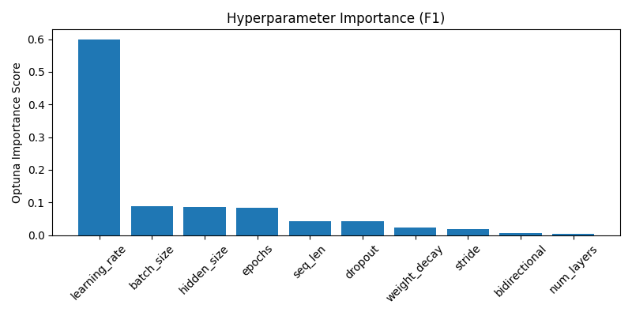
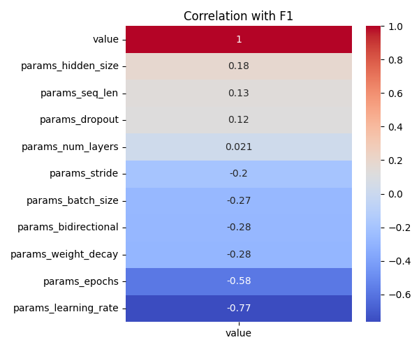

# Optuna LSTM Tuning Summary
- Date: 2025-05-28
- Subject: 7242
- Trials: 30
- Objective: Maximize F1 Score

---

## Best Trial
- **F1 Score**: 0.8214
- **Threshold**: 0.64
- **Accuracy**: 0.8235
- **Params**
  - `hidden_size`: 128
  - `num_layers`: 2
  - `dropout`: 0.46113270413265095
  - `bidirectional`: False
  - `learning_rate`: 0.00011982944130266843
  - `stride`: 1
  - `seq_len`: 64
  - `epochs`: 9
  - `batch_size`: 64
  - `weight_decay`: 1.3467657668402778e-05

---

## Top 5 Trials
| Trial | F1 Score | Threshold | Accuracy |
|-------|----------|-----------|----------|
| 3 | 0.8214 | 0.64 | 0.8235 |
| 23 | 0.8162 | 0.6 | 0.8144 |
| 12 | 0.8157 | 0.57 | 0.8152 |
| 15 | 0.8119 | 0.65 | 0.8116 |
| 26 | 0.8078 | 0.57 | 0.8029 |

---

## Visualizations
### Hyperparameter Importance

### Correlation Heatmap

---

## Notes