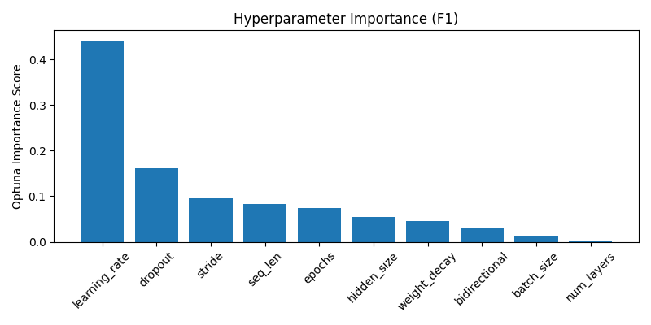

# Optuna LSTM Tuning Summary
- Date: 2025-06-08
- Subject: 7242
- Trials: 15
- Objective: Maximize F1 Score

---

## Best Trial
- **F1 Score**: 0.8204
- **Threshold**: 0.6
- **Accuracy**: 0.8236
- **Params**
  - `hidden_size`: 256
  - `num_layers`: 3
  - `dropout`: 0.401186224750197
  - `bidirectional`: False
  - `learning_rate`: 0.0003304348433563705
  - `stride`: 1
  - `seq_len`: 128
  - `epochs`: 5
  - `batch_size`: 128
  - `weight_decay`: 0.0007086346025533876

---

## Top 5 Trials
| Trial | F1 Score | Threshold | Accuracy |
|-------|----------|-----------|----------|
| 14 | 0.8204 | 0.6 | 0.8236 |
| 12 | 0.8203 | 0.62 | 0.8241 |
| 13 | 0.8138 | 0.56 | 0.8166 |
| 11 | 0.7974 | 0.62 | 0.7960 |
| 3 | 0.7912 | 0.61 | 0.7849 |

---

## Visualizations
### F1 Line Plot

### Hyperparameter Importance

### Correlation Heatmap

---

## Notes