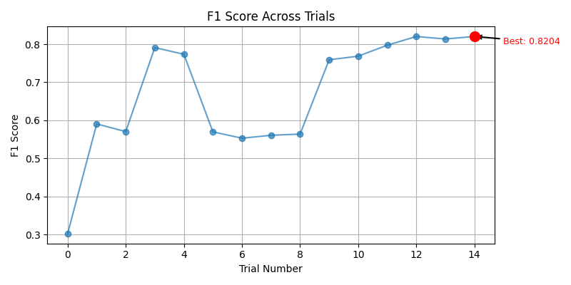

# Optuna LSTM Tuning Summary
- Date: 2025-06-08
- Subject: 7242
- Trials: 10
- Objective: Maximize F1 Score

---

## Best Trial
- **F1 Score**: 0.8260
- **Threshold**: 0.7
- **Accuracy**: 0.8364
- **Params**
  - `hidden_size`: 64
  - `num_layers`: 2
  - `dropout`: 0.108466076468862
  - `bidirectional`: True
  - `learning_rate`: 0.00082609199251563
  - `stride`: 4
  - `seq_len`: 128
  - `epochs`: 13
  - `batch_size`: 32
  - `weight_decay`: 0.00010376177657048565

---

## Top 5 Trials
| Trial | F1 Score | Threshold | Accuracy |
|-------|----------|-----------|----------|
| 9 | 0.8260 | 0.7 | 0.8364 |
| 3 | 0.7945 | 0.59 | 0.7877 |
| 4 | 0.7777 | 0.62 | 0.7787 |
| 5 | 0.7097 | 0.58 | 0.6788 |
| 6 | 0.5832 | 0.53 | 0.5399 |

---

## Visualizations
### F1 Line Plot

### Hyperparameter Importance

### Correlation Heatmap

---

## Notes