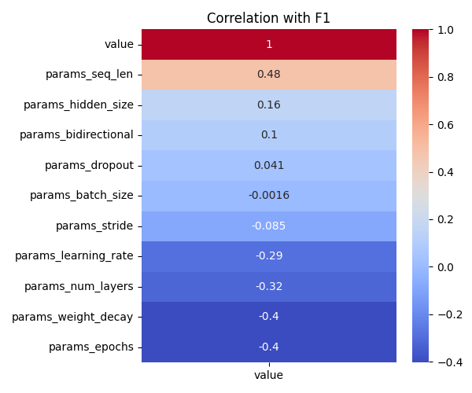

# Optuna LSTM Tuning Summary
- Date: 2025-06-09
- Subject: 7242
- Trials: 10
- Objective: Maximize F1 Score

---

## Best Trial
- **F1 Score**: 0.7931
- **Threshold**: 0.57
- **Accuracy**: 0.7936
- **Params**
  - `hidden_size`: 64
  - `num_layers`: 2
  - `dropout`: 0.36965344602653816
  - `bidirectional`: True
  - `learning_rate`: 0.0007133471581159139
  - `stride`: 2
  - `seq_len`: 128
  - `epochs`: 8
  - `batch_size`: 64
  - `weight_decay`: 0.003062273519768889

---

## Top 5 Trials
| Trial | F1 Score | Threshold | Accuracy |
|-------|----------|-----------|----------|
| 1 | 0.7931 | 0.57 | 0.7936 |
| 6 | 0.7871 | 0.58 | 0.7745 |
| 8 | 0.7840 | 0.64 | 0.7831 |
| 7 | 0.7373 | 0.6 | 0.7154 |
| 4 | 0.7363 | 0.6 | 0.7201 |

---

## Visualizations
### F1 Line Plot

### Hyperparameter Importance

### Correlation Heatmap

---

## Notes