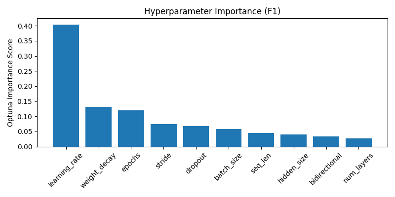

# Optuna LSTM Tuning Summary
- Date: 2025-06-09
- Subject: 7242
- Trials: 10
- Objective: Maximize F1 Score

---

## Best Trial
- **F1 Score**: 0.5931
- **Threshold**: 0.5
- **Accuracy**: 0.5921
- **Params**
  - `hidden_size`: 128
  - `num_layers`: 3
  - `dropout`: 0.32605054158312186
  - `bidirectional`: True
  - `learning_rate`: 0.0007451376549375596
  - `stride`: 1
  - `seq_len`: 64
  - `epochs`: 9
  - `batch_size`: 64
  - `weight_decay`: 0.0022291764931384015

---

## Top 5 Trials
| Trial | F1 Score | Threshold | Accuracy |
|-------|----------|-----------|----------|
| 8 | 0.5931 | 0.5 | 0.5921 |
| 9 | 0.5698 | 0.5 | 0.5575 |
| 1 | 0.5196 | 0.5 | 0.5176 |
| 3 | 0.4382 | 0.5 | 0.4473 |
| 4 | 0.4369 | 0.5 | 0.4339 |

---

## Visualizations
### F1 Line Plot

### Hyperparameter Importance

### Correlation Heatmap

---

## Notes